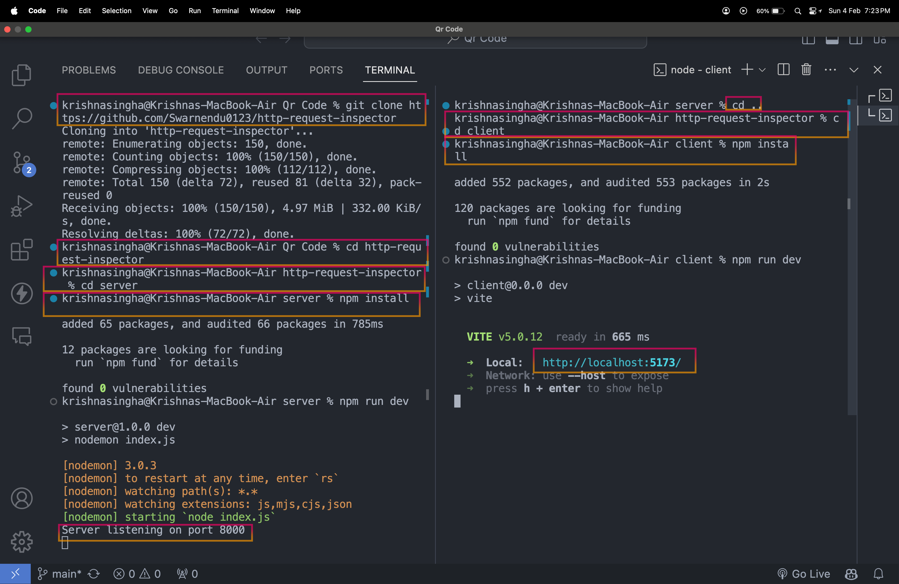

## Installation

- Here is the image for your reference.



<hr>

To run the Request Analyzer locally, follow these steps:

1. Clone the repository:

   ```bash
   git clone https://github.com/Swarnendu0123/http-request-inspector
   ```

2. Navigate to the project directory:

   ```bash
   cd http-request-inspector
   ```

3. Install dependencies for the server:

   ```bash
   cd server
   npm install
   ```
   
4. Open another terminal and Install dependencies for the client:

   ```bash
   cd client
   npm install
   ```

5. Start the server:

   ```bash
   npm run dev
   ```

6. Start the client:

   ```bash
   npm run dev
   ```

7. Access the application in your web browser at `http://localhost:5173`. The backend is running on `http://localhost:8000`.

