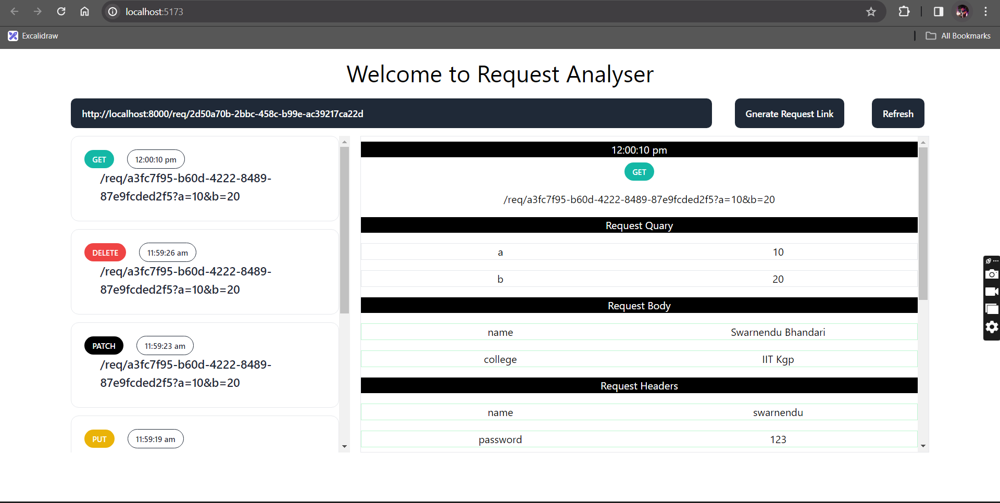

# Request Analyzer

Request Analyzer is a web application built with React and Express that allows users to analyze and inspect HTTP requests sent to a custom URL. With Request Analyzer, you can monitor incoming requests, view detailed information about each request, and track request trends over time.



## Developers

[Swarnendu Bhandari](https://github.com/Swarnendu0123)

## Demonstration
[](./assets/example.mp4)

## Features

- **HTTP Request Monitoring:** Receive and display incoming HTTP requests in real-time.
- **Detailed Request Information:** View detailed information about each request, including headers, body, method, and timestamp.
- **User-Friendly Interface:** Intuitive and easy-to-use interface for analyzing and inspecting HTTP requests.
- **Security Measures:** Implement proper authentication and authorization mechanisms to ensure secure access to request details.
- **Scalability:** Designed with scalability in mind to handle large volumes of concurrent requests.

## Installation

To run the Request Analyzer locally, follow these steps:

1. Clone the repository:

   ```bash
   git clone https://github.com/your-username/request-analyzer.git
   ```

2. Navigate to the project directory:

   ```bash
   cd request-analyzer
   ```

3. Install dependencies for the server:

   ```bash
   cd server
   npm install
   ```

4. Open another terminal and Install dependencies for the client:

   ```bash
   cd client
   npm install
   ```

5. Start the server:

   ```bash
   npm run dev
   ```

6. Start the client:

   ```bash
   npm run dev
   ```

7. Access the application in your web browser at `http://localhost:5173`.

## Usage

1. Access the Request Analyzer web application in your browser.
2. Send HTTP requests to the custom URL provided by the application.
3. View incoming requests and their details in the application interface.
4. Analyze request headers, body, method, and timestamp to gain insights into request patterns and trends.
5. Use the application interface to navigate through request details efficiently.
6. Implement security measures as needed to ensure secure access to request details.

## Contributing

Contributions to the Request Analyzer project are welcome! To contribute, follow these steps:

1. Fork the repository.
2. Create a new branch for your feature or bug fix.
3. Make changes and test them thoroughly.
4. Commit your changes and push them to your fork.
5. Submit a pull request to the main repository's `master` branch.

## License

This project is licensed under the MIT License. See the [LICENSE](LICENSE) file for details.# request-alalyser
